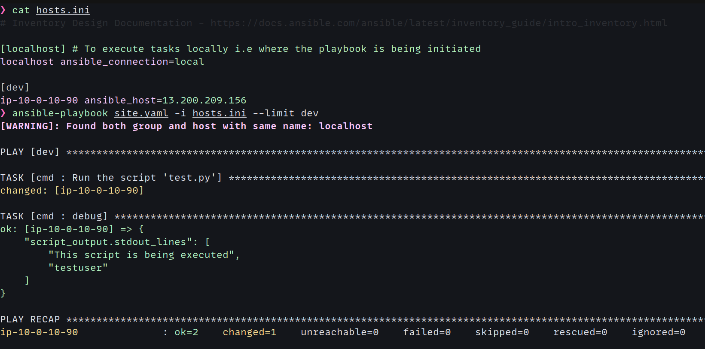

[](https://github.com/psadi/ansible-remote-script-exec/actions/workflows/ci.yaml)

## **Scenario:**

Ansible playbook triggered as one (default) [remote_user](https://docs.ansible.com/ansible/9/collections/ansible/builtin/ssh_connection.html#ssh-connection) (_Details on the `remote_user` keyword and `ansible_user` variable_) which should execute a script in the remote host as a diffrent user

### **Project Tree**

```bash
.
├── ansible.cfg                 # Ansible Configuration
├── hosts.ini                   # Ansible Inventory
├── img.png                     # Demo Output of playbook, See Below
├── LICENSE                     # Project License (MIT)
├── README.md
├── roles                       # Ansible Default Roles Directory
│  └── cmd                      # Ansible "cmd" Role
│     ├── files                 # Files Directory which Ansible reads when the Role `cmd` in invoked
│     │  └── test.py            # Remote Script to execute
│     └── tasks                 # Ansible Role Tasks
│        └── main.yaml          # Tasks Entry Point
├── SECURITY-IMPLECATIONS.md    # Security Implications Guidelines
└── site.yaml                   # Ansible Playbook Entry Point
```

### **Execute Ansible playbook**

`ansible-playbook site.yaml -i hosts.ini`

### **Output:**



---

### **Technical/Security Implications of Executing a Script with Ansible as a Different User**

Executing a script from Ansible on a remote host as a different user using sudo involves careful consideration of privilege escalation, user permissions, environment variables, and error handling. Proper configuration of the Ansible playbook and the target system's sudoers file is essential for successful execution. Additionally, adhering to best practices for security, testing, and idempotency will help ensure a smooth and reliable automation process.

For Additional Info _Refer:_ [SECURITY-IMPLICATIONS](./SECURITY-IMPLICATIONS.md)
